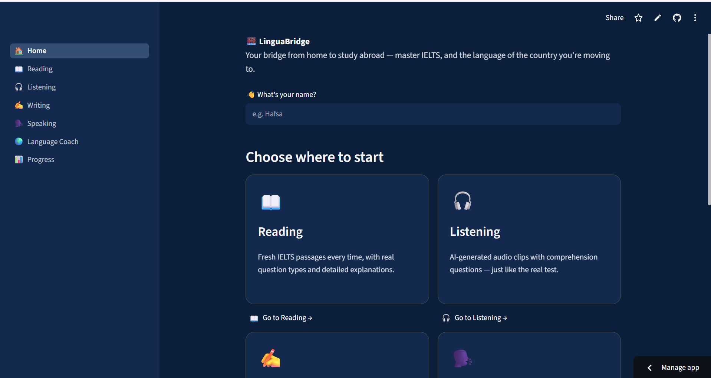

# 🌉 LinguaBridge — IELTS Prep & Language Coach for Study-Abroad Students

## a. What it does & the problem it solves

**LinguaBridge** is an all-in-one prep app for students preparing to study
abroad. It solves two real problems at once:

1. **Passing IELTS is expensive and hard to practice for.** Coaching
   centers charge a lot, and it's hard to find someone to practice real
   speaking interviews with or get honest, detailed feedback on writing.
2. **Passing IELTS doesn't mean you can actually speak the language
   confidently once you land.** Students often arrive abroad with a good
   band score but freeze up in real situations like renting a flat or
   talking to a landlord.

LinguaBridge covers **all four IELTS sections** (Reading, Listening,
Writing, Speaking) with an AI examiner that generates fresh practice
material and gives real, band-scored feedback every time — plus a
**Language Coach** mode for practicing everyday conversation in the
language of the country the student is actually moving to.

**Who it's for:** Students (particularly from Pakistan) preparing IELTS
for university admission or visa purposes, who want realistic, repeatable
practice without paying for expensive coaching every session.

## b. Live app

🔗 **[PASTE YOUR LIVE STREAMLIT URL HERE]**

## c. Features

- 📖 **Reading Practice** — AI generates a brand-new IELTS-style passage
  every time, with a mix of real question types (True/False/Not Given,
  multiple choice, sentence completion), instant scoring, and detailed
  explanations for every wrong answer.
- 🎧 **Listening Practice** — AI writes a listening script and converts it
  into real playable audio (text-to-speech), then asks comprehension
  questions based only on what was said — just like the real test.
- ✍️ **Writing Practice** — Real Task 1 (report/chart) and Task 2 (essay)
  prompts, scored against the four **official IELTS band criteria** (Task
  Achievement, Coherence & Cohesion, Lexical Resource, Grammar) with
  specific written feedback for each.
- 🗣️ **Speaking Mock Interview** — A full 3-part IELTS Speaking interview
  (Part 1 personal questions, Part 2 cue card, Part 3 discussion)
  conducted turn-by-turn by an AI examiner, followed by a band-score
  breakdown and a list of the student's most common mistakes with gentle
  corrections.
- 🌍 **Language Coach** — Two modes in one page:
  - **Learn a Language**: pick any of 12 languages (Arabic, German, Urdu,
    English, Hindi, French, Spanish, Chinese, Turkish, Japanese, Korean,
    Italian) and work through a real structured curriculum from Level 1
    (alphabet & pronunciation) through Level 6 (advanced fluency &
    idioms) — each level generates a full lesson with vocabulary,
    example sentences, and a practice quiz with feedback.
  - **Practice Conversation**: pick a destination country and a
    real-life scenario (renting a flat, ordering food, opening a bank
    account, etc.) and have a live conversation with an AI partner who
    corrects mistakes mid-conversation.
- 📊 **Progress Tracker** — Every attempt across every section is saved
  with a band score, so students can see a chart of their improvement
  over time.

## d. The AI feature

Every section of this app is powered by **Groq**, running Meta's
`llama-3.3-70b-versatile` model, called through custom system prompts
written specifically to make the AI behave like a real IELTS examiner
rather than a generic chatbot. All
prompts live in [`utils/prompts.py`](utils/prompts.py) — for example, the
Writing scoring prompt instructs the model to:

> "Score it EXACTLY the way real IELTS examiners do, against the four
> official band criteria... Be encouraging but DO NOT inflate scores —
> accuracy matters more than making the student feel good, since they
> need a real estimate of where they stand."

And the Speaking examiner prompt makes the AI follow the real 3-part
IELTS Speaking structure, asking one question at a time and tracking
conversation state, rather than just chatting freely.

Every AI response used for scoring is requested and parsed as **structured
JSON** (band scores, feedback text) so it can be displayed in proper score
cards and saved to the progress tracker — not just dumped as raw chat text.

## e. Tools, services, and models used

- **Frontend/Framework:** [Streamlit](https://streamlit.io/) (Python)
- **AI model:** Groq, running Meta's `llama-3.3-70b-versatile` model, via
  the `groq` Python SDK
- **Text-to-speech:** `gTTS` (Google Text-to-Speech) for generating real
  Listening-section audio
- **Data:** `pandas` for the progress chart
- **Hosting:** Streamlit Community Cloud
- **Built with help from:** Claude (Anthropic) for planning, code, and
  system prompt design

## f. Screenshots

<!-- Add at least 3 screenshots below. Example: -->
<!--  -->
<!--  -->
<!--  -->

## g. How to run this project locally

1. **Clone the repo**
   ```bash
   git clone https://github.com/YOUR-USERNAME/linguabridge.git
   cd linguabridge
   ```

2. **Install dependencies**
   ```bash
   pip install -r requirements.txt
   ```

3. **Add your Groq API key**
   - Get a free key at [Groq Console](https://console.groq.com/keys)
   - Copy `.streamlit/secrets.toml.example` to `.streamlit/secrets.toml`
   - Paste your key in:
     ```toml
     GROQ_API_KEY = "your-real-key-here"
     ```

4. **Run the app**
   ```bash
   streamlit run Home.py
   ```

5. Open the local URL Streamlit gives you (usually `http://localhost:8501`).

---

### Deploying to Streamlit Community Cloud (what powers the live link above)

1. Push this repo to your own **public** GitHub account.
2. Go to [share.streamlit.io](https://share.streamlit.io), sign in with
   GitHub, and click "New app".
3. Select this repo, branch `main`, and set the main file to `Home.py`.
4. In the app's **Settings → Secrets**, paste:
   ```toml
   GROQ_API_KEY = "your-real-key-here"
   ```
5. Deploy — you'll get a public URL like `https://your-app-name.streamlit.app`.
